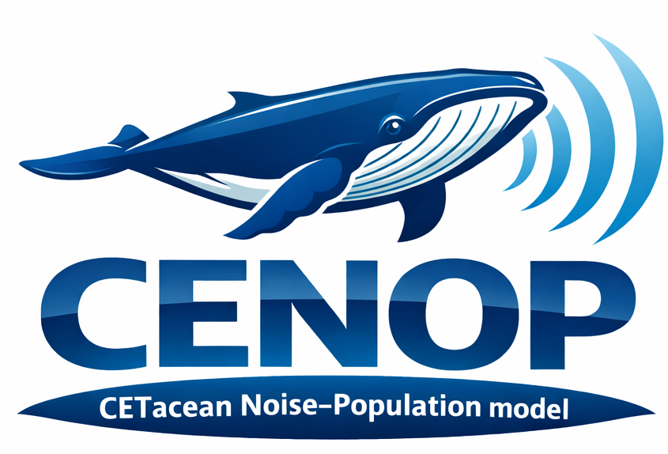

# CENOP-JASMINE



**CETacean Noise-Population Model with JASMINE Extensions**

CENOP is a Python translation of the DEPONS (Disturbance Effects of POrpoises in the North Sea) agent-based model. It simulates how harbour porpoise population dynamics are affected by disturbances from offshore wind farm construction and ship noise.

The JASMINE (Just Another Simulation Model In Nature Environments) extension adds research-grade physics-based movement, dynamic energy budgets, and learned avoidance behaviors.

## Simulation Modes

- **DEPONS Mode (Default):** Regulatory-compatible empirical models validated against DEPONS 3.0
- **JASMINE Mode (Research):** Physics-based movement, Dynamic Energy Budget (DEB), and learned animal behaviors

## Features

### Core Features
- Agent-based simulation of harbour porpoise populations
- Realistic North Sea and Central Baltic landscapes with bathymetry and food distribution
- Noise disturbance modeling (pile-driving and ship noise)
- Interactive Shiny web interface
- Real-time visualization of population dynamics

### JASMINE Extensions
- **Behavioral State Machine:** FORAGING, TRAVELING, RESTING, DISPERSING, and DISTURBED states with configurable transitions
- **Dynamic Energy Budget:** Body mass-dependent metabolism, activity costs, thermoregulation, and disturbance energy impacts
- **Disturbance Memory:** Spatial memory with learned avoidance of disturbance zones and habituation support
- **Physics-Based Movement:** Hydrodynamic drag, thrust-based propulsion, and ocean current advection

## Installation

```bash
# Clone the repository
git clone https://github.com/your-org/cenop-jasmine.git
cd cenop-jasmine

# Create virtual environment
python -m venv venv
source venv/bin/activate  # On Windows: venv\Scripts\activate

# Install dependencies
pip install -r requirements.txt

# Or install as package
pip install -e .
```

## Quick Start

```bash
# Run the Shiny application
shiny run app.py
```

Then open your browser to http://localhost:8000

## Deployment

### Production Server: laguna.ku.lt

The application is deployed on the Shiny Server at `laguna.ku.lt`.

**Server Configuration:**
- Shiny Server path: `/srv/shiny-server/cenjas` (symlink)
- Application directory: `/home/razinka/cenjas`
- User: `razinka`
- URL: https://laguna.ku.lt/cenjas/

### Windows Deployment (Recommended)

Use the provided `deploy.cmd` script from Windows. Double-click or run from command prompt:

```cmd
deploy.cmd
```

The interactive menu provides the following options:

```
[1] Full deployment (pull, install, permissions, restart)
[2] Pull latest changes only
[3] Update dependencies only
[4] Fix permissions for shiny user only
[5] Restart Shiny Server only
[6] View server logs
[7] Check application status
[0] Exit
```

### Manual Deployment (Linux/SSH)

```bash
# 1. SSH into the server
ssh razinka@laguna.ku.lt

# 2. Navigate to the application directory
cd ~/cenjas

# 3. Pull the latest changes
git fetch origin && git reset --hard origin/main

# 4. Update dependencies
source venv/bin/activate
pip install -r requirements.txt
pip install -e .

# 5. Set permissions for shiny user
find ~/cenjas -type d -exec chmod 755 {} \;
find ~/cenjas -type f -exec chmod 644 {} \;
chmod 755 ~/cenjas/venv/bin/*
chmod 755 /home/razinka

# 6. Restart Shiny Server
sudo systemctl restart shiny-server
```

### Shiny User Permissions

The shiny server runs as the `shiny` user, which needs read access to the application files. Required permissions:
- Home directory `/home/razinka`: 755 (allows shiny to traverse)
- All directories: 755 (read + execute for shiny)
- All files: 644 (read for shiny)
- venv binaries: 755 (executable)

The `deploy.cmd --permissions-only` command sets these automatically

## Project Structure

```
cenop-jasmine/
├── app.py                  # Shiny application entry point
├── src/cenop/              # Core simulation package
│   ├── core/               # Simulation engine, scheduler, time manager
│   ├── agents/             # Agent definitions (porpoise, turbine, ship)
│   ├── behavior/           # Behavioral modules
│   │   ├── hybrid_fsm.py   # Behavioral state machine
│   │   ├── disturbance_memory.py  # Learned avoidance
│   │   ├── psm.py          # Persistent spatial memory
│   │   └── dispersal.py    # Dispersal behavior
│   ├── physiology/         # Energy budget modules
│   │   └── energy_budget.py  # DEPONS/JASMINE energy systems
│   ├── movement/           # Movement systems
│   │   ├── hybrid.py       # Mode selector
│   │   ├── depons_crw.py   # Correlated random walk
│   │   └── jasmine_physics.py  # Physics-based movement
│   ├── landscape/          # Environmental data
│   └── parameters/         # Configuration and constants
├── ui/                     # Shiny UI components
├── server/                 # Shiny server logic
├── data/                   # Landscape and wind farm data
└── tests/                  # Test suite
```

## Configuration

### Selecting Simulation Mode

**Via UI:** Select "DEPONS (Regulatory)" or "JASMINE (Research)" from the sidebar dropdown.

**Via Code:**
```python
from cenop import Simulation, SimulationParameters

params = SimulationParameters(
    porpoise_count=1000,
    sim_years=5,
    simulation_mode="JASMINE",  # or "DEPONS"
    # Optional subsystem overrides:
    energy_mode="JASMINE",      # Use DEB energy budget
    memory_mode="JASMINE",      # Use learned avoidance
    fsm_mode="JASMINE",         # Use enhanced behavioral FSM
)

sim = Simulation(params)
```

### JASMINE-Specific Parameters

| Parameter | Default | Description |
|-----------|---------|-------------|
| `jasmine_mass_kg` | 50.0 | Body mass (kg) |
| `jasmine_drag_coeff` | 0.01 | Hydrodynamic drag coefficient |
| `jasmine_bmr_scale` | 1.0 | Basal metabolic rate scale factor |
| `memory_decay_rate` | 0.001 | Memory decay per tick |
| `habituation_enabled` | True | Enable habituation to disturbance |

## Validation

- **DEPONS mode:** Validated against DEPONS 3.0 for regulatory compliance
- **JASMINE mode:** Research-grade, designed for exploring advanced behavioral hypotheses

## License

This project is licensed under the GNU General Public License v2.0, following the original DEPONS model.

## Acknowledgments

- Original DEPONS model by Jacob Nabe-Nielsen, Aarhus University
- JASMINE behavioral extensions developed for the AI4WIND project
- EU Horizon 2020 SATURN project (GA 101006443)
- AI4WIND project team
