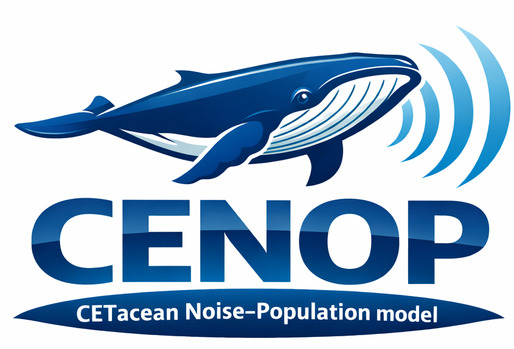

# CENOP



**CETacean Noise-Population Model**

CENOP is a Python translation of the DEPONS (Disturbance Effects of POrpoises in the North Sea) agent-based model. It simulates how harbour porpoise population dynamics are affected by disturbances from offshore wind farm construction and ship noise.

## Features

- 🐬 Agent-based simulation of harbour porpoise populations
- 🗺️ Realistic North Sea landscape with bathymetry and food distribution
- 🌊 Realistic Central Baltic landscape with bathymetry and food distribution
- 🔊 Noise disturbance modeling (pile-driving and ship noise)
- 📊 Interactive Shiny web interface
- 📈 Real-time visualization of population dynamics

## Installation

```bash
# Clone the repository
git clone https://github.com/your-org/cenop.git
cd cenop

# Create virtual environment
python -m venv venv
source venv/bin/activate  # On Windows: venv\Scripts\activate

# Install dependencies
pip install -r requirements.txt

# Or install as package
pip install -e .
```

## Quick Start

```bash
# Run the Shiny application
shiny run app.py
```

Then open your browser to http://localhost:8000

## Project Structure

```
cenop/
├── app.py                  # Shiny application entry point
├── src/cenop/              # Core simulation package
│   ├── core/               # Simulation engine
│   ├── agents/             # Agent definitions
│   ├── behavior/           # Behavioral modules
│   ├── landscape/          # Environmental data
│   └── parameters/         # Configuration
├── ui/                     # Shiny UI components
├── data/                   # Landscape data files
└── tests/                  # Test suite
```

## Performance & Profiling ⚡️

We added several performance improvements to make large-scale simulations much faster and more memory-efficient. Key improvements and how to use them:

- KD-tree neighbor lookup for social communication using `scipy.spatial.cKDTree`, with a fallback binning method when SciPy is not available.
- Batched neighbor aggregation using SciPy sparse structures (`sparse_distance_matrix` and `coo_matrix`), avoiding Python-level pair lists.
- Single multi-block sparse matrix to accumulate UX/UY/SW channels in one allocation to reduce memory churn.
- Optional Numba helpers with an automatic warm-up at `Simulation.initialize()` to move JIT compilation cost to startup.
- Neighbor topology caching plus **adaptive recompute interval**:
  - Parameter: `communication_recompute_interval` (default: 4 ticks)
  - Adaptive mode enabled via `communication_recompute_adaptive=True` with tunables:
    - `communication_recompute_min_interval` (default 1)
    - `communication_recompute_max_interval` (default 16)
    - `communication_recompute_disp_threshold_m` (meters per tick, default 50.0)
    - `communication_recompute_ema_alpha` (EMA smoothing, default 0.3)
  - The simulation updates an EMA of mean displacement and increases/decreases topology recompute interval accordingly to save computation when animals move slowly.

How to profile locally:

```bash
# Quick profiling harness
python cenop/tools/profile_simulation.py --ticks 100 --pop 500
# Or larger, representative workload
python cenop/tools/profile_simulation.py --ticks 200 --pop 2000
# Outputs a cProfile report and writes cprofile.prof to the repo root.
```

Next recommended improvements (planned):

1. Make the recompute interval more graded/proportional to displacement (improved adaptivity).
2. Apply the same caching/adaptive pattern to PSM updates and other spatial kernels if patches are stable over short time windows.
3. Add a CI microbenchmark that runs a small representative workload and fails when the median runtime increases beyond a small tolerance.

If you'd like, I can continue with these improvements (adaptive grading → PSM caching → CI microbench) and prepare PR(s) for review.

## License

This project is licensed under the GNU General Public License v2.0, following the original DEPONS model.

## Acknowledgments

- Original DEPONS model by Jacob Nabe-Nielsen, Aarhus University
- EU Horizon 2020 SATURN project (GA 101006443)

## Contact

If you have questions about this repository or the CENOP project, please contact:

Arturas Razinkovas-Baziukas
Marine Research Institute, Klaipėda University
Email: [arturas.razinkovas-baziukas@ku.lt](mailto:arturas.razinkovas-baziukas@ku.lt)

